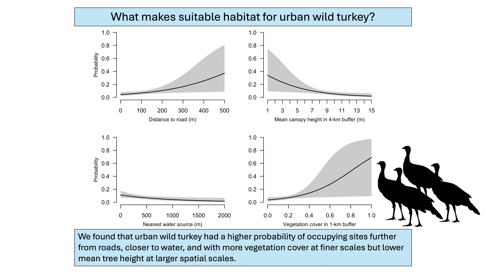

# R script, JAGS models, and data used to fit an autologistic occupancy model for wild turkey in Washington, D.C. USA

# Returning Neighbors: Eastern Wild Turkey (Meleagris gallopavo silvestris) Occupancy in an Urban Landscape

# **Authors**

Merri Collins, Katherine Edwards, Scott Bates, and Travis Gallo

# **File Descriptions**

## **Scripts:**

**Scripts/TurkeyMultiOccu_package_laod.R** - run this script to download and 
load all scripts needed in this analysis

**Scripts/2025-07-21_landscape_variables.R** - this script will calculate and 
scale all covariates used in the autologistic occupancy model. **Note**: there 
are many publically GIS layers needed in this analysis. We have not included these
data, but have included relevant urls (active at the creation of this repository)
within this script.

**Scripts/2025-07-21_fit_JAGS.R** - this script will format turkey observations
into detection histories, calculate an observation covariate,  fit and run 
diagnostics on the autologistic occupancy JAGS model.

**Scripts/2025-07-21_summarize_plot.R** - creates Figure 2

**Scripts/2025-07-21_summarize_results.R** - calculates summary statistics of 
observation data and odds ratios, variable inclusion probabilities, and Tables 2 
and 3 from model results.

**Scripts/2025-07-21_lasso_model_jags.R** - JAGS model script for multi-season 
autologistic occupancy model

**Scripts/2025-07-21_reduced_lasso_model_jags.R** - JAGS model script for 
multi-season autologistic occupancy model using only the 11 variables that remained
after the variable selection procedure

## **Directories and Data Files:**

**Data/TurkeyOccupancyReport.csv** - Detection data of wild turkey in Washington, D.C.
This data is read into `Scripts/2025-07-21_landscape_variables.R` and 
`Scripts/2025-07-21_fit_JAGS.R`.

This data has 51 columns

| Column header | Data type | Description                                           |
|---------------|-----------|-------------------------------------------------------|
| Species       | character | The name of the species                               |
| Season        | character | The season  for which observation was collected       | 
| Site          | character | The name of the camera location                       | 
| Latitude      | numeric   | Latitude coordinates (WGS84)                          | 
| Longitude     | numeric   | Longitude coordinates  (WGS84)                       |                               | 
| Day_1-Day_45  | numeric   | Detection (1 detected or 0 not detected)               |

**GIS/** - empty directory to save GIS layers. To line up with the current working
directory, this folder must exist and GIS layers must be saved in this directory.
See scripts for sub-directory labels.

**Results/** - empty directory to save results and figure to

**Note:** All of these files must be within your working directory for
the analysis to work. Analyses were done in parallel. Therefore,
you will need to adjust the settings accordingly.

##

